implementing Ray tracing from scratch in c++.

## current: full scene (motion blur)
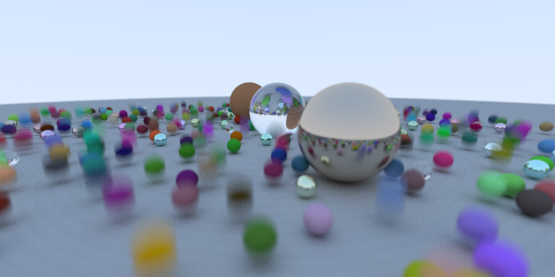

## progress

| | | |
|---|---|---|
| **hittable spheres**   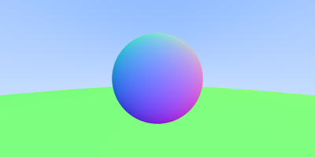 | **diffuse (monte carlo)**   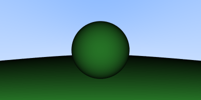 | **matte / gamma correction**   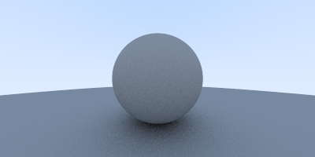 |
| **lambertian material**   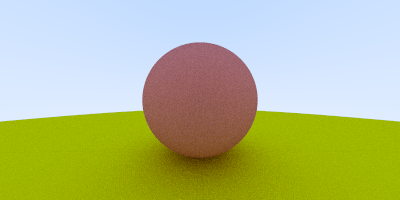 | **metal material**   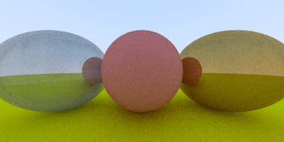 | **glass / refraction**   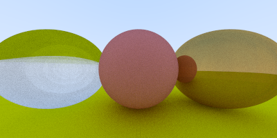 |
| **geometric refraction**   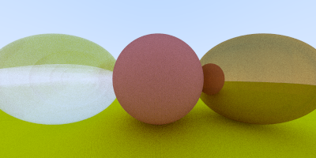 | **schlick approximation**   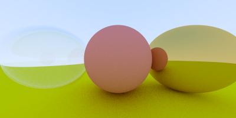 | **camera fov**   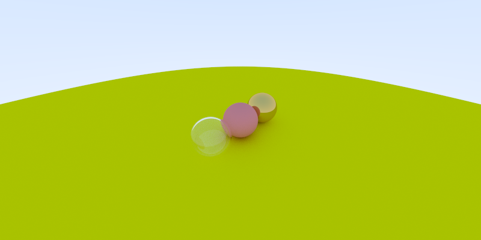 |
| **defocus blur**   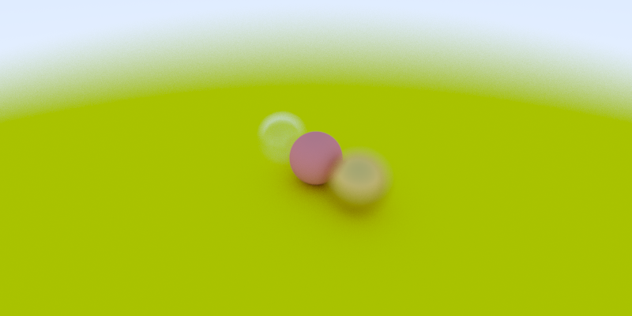 | | |

check the `outputs/` directory for the full-resolution `.ppm` renders.

[1] https://www.realtimerendering.com/raytracing/Ray%20Tracing%20in%20a%20Weekend.pdf
