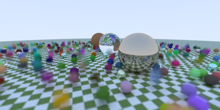

implementing Ray tracing from scratch in c++.

## current: checker texture (procedural, 1000 samples/pixel)

## progress

| | | |
|---|---|---|
| **hittable spheres**    | **diffuse (monte carlo)**    | **matte / gamma correction**    |
| **lambertian material**    | **metal material**    | **glass / refraction**    |
| **geometric refraction**    | **schlick approximation**    | **camera fov**    |
| **defocus blur**    | **motion blur**    | **BVH acceleration**    |
| **checker texture**    | | |

## acceleration structure

Objects are wrapped in a bounding volume hierarchy (`bvh.h`) before rendering: `world = hitable_list(std::make_shared<bvh_node>(world))`. Each `bvh_node` recursively splits the object list along a random axis, sorted by each object's `aabb` (`aabb.h`), until leaves hold 1-2 primitives; every internal node's box is the union of its children's. `hit()` then rejects whole subtrees via a single box test (`bbox.hit`) instead of checking every object, turning scene traversal into O(log n) instead of O(n).

## textures

`texture.h` adds a `texture` interface with `value(u, v, point)`. `lambertian` now holds a `std::shared_ptr<texture>` instead of a raw albedo, so any material can be handed a procedural or solid texture. `checker_texture` alternates between two child textures based on the floored, scaled sum of the hit point's world coordinates, giving the 3D checker pattern independent of the sphere's parameterization. `hit_record` also gained `u`/`v` fields for future image/UV-mapped textures.

check the `outputs/` directory for the full-resolution `.ppm` renders.

[1] https://www.realtimerendering.com/raytracing/Ray%20Tracing%20in%20a%20Weekend.pdf
